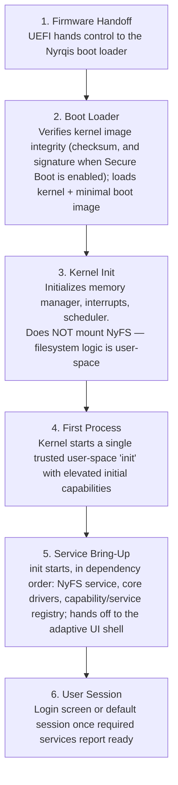

# Boot Sequence

*Source: NPS-001 §5 (NyKernel Backend). Other backends satisfy the same
stages in substance without matching the stage names (NPS-017 §4.5).*

**Failure handling** (NPS-001 §6): failure in Stage 5 **MUST NOT** halt
boot if the service isn't required for a minimal session; failure in
Stages 1–4 **MUST** halt with a diagnostic screen. Stage transitions
**MUST** be order-validated at the API level (NPS-001 §5).

**Secure Boot** (ADR-0014): the boot loader verifies against a Nyrqis
key, with user-enrollable keys for self-built or Experimental Backend
kernels.
