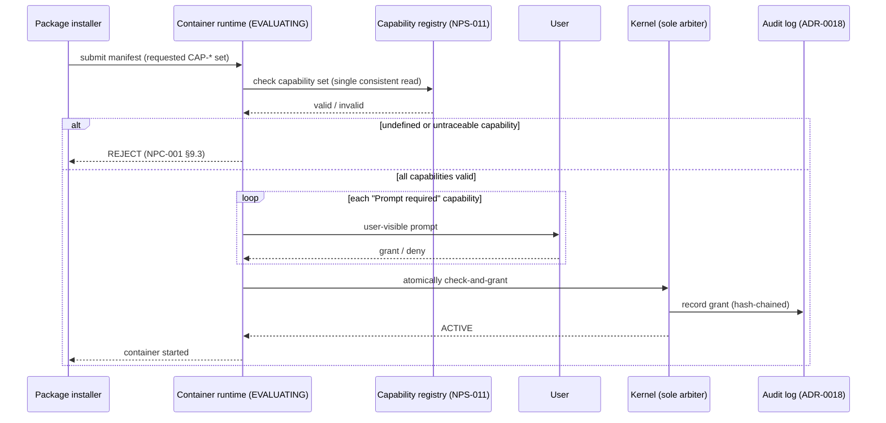

# Capability Grant Flow

*Source: NPS-010 §4.2 (atomic check-and-grant), NPS-011 §4 (default
grant behavior), NPS-003 §5 (transfer/attenuation).*

**Rules the flow enforces:**

- A `Prompt required` capability must produce a user-visible prompt
  before the grant completes, unless previously granted to this exact
  application and not revoked (NPS-011 §4.2).
- A `Denied by default` capability is not grantable through the standard
  prompt flow at all (NPS-011 §4.3).
- The kernel is the **sole arbiter** of capability validity — no
  user-space process can forge or self-issue (NPS-003 §5.4).
- Narrowing is allowed at transfer time; widening is not (NPS-003 §5.3).
