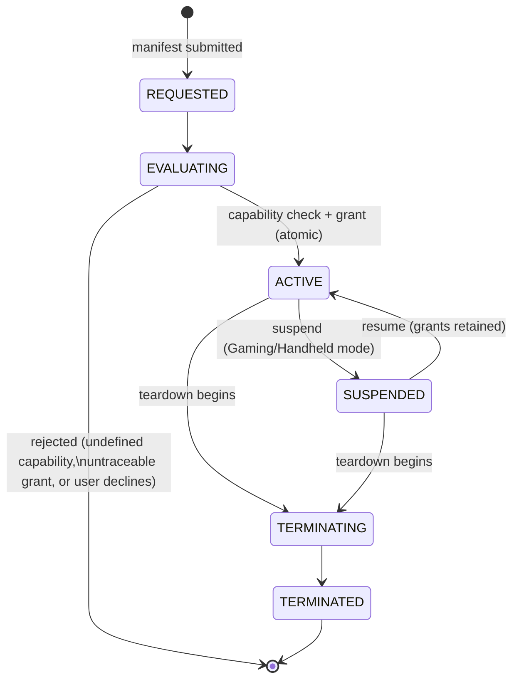

# Container Lifecycle

*Source: NPS-010 §4.*

**Notes** (NPS-010 §4–§6, §8):

- **EVALUATING** — the requested capability set is checked against the
  registry (NPS-011) and against what the requester may itself grant
  (NPS-002 §7.1). An undefined capability **MUST** be rejected
  (NPC-001 §9.3). The check and the grant are **one atomic operation**
  (NPS-010 §4.2).
- **ACTIVE** — grants are fixed; nothing may be added except through the
  auditable request path (NPS-010 §5.1). The container may narrow its own
  set irreversibly (NPS-010 §5.2).
- **SUSPENDED** — all processes suspended; granted capabilities retained,
  not re-evaluated (NPS-010 §4.4).
- Every grant and revocation lands in the tamper-evident audit log
  (NPS-010 §8.1, ADR-0018).
