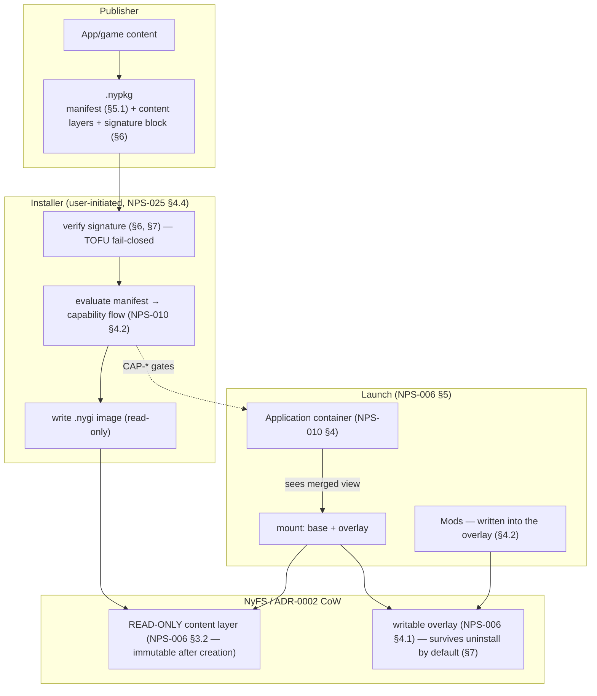

# Game Package Layering

*Source: NPS-026 (.nypkg installable unit — manifest, signature block,
verification pipeline), NPS-006 (.nygi image structure §3, overlay §4,
mount lifecycle §5), NPS-005 §5 (compression), NPS-011 (the
capability gates at each boundary).*

**Rules the layering encodes:**

- The publisher's signature covers the manifest and content (NPS-026
  §6); verification is a precondition of install, never a warning
  (the FIND-PACKAGE-001/003 line, closed by NPS-027/NPS-026 §6).
- The `.nygi` content layer is **immutable** after creation (NPS-006
  §3.2); every mutation — saves, mods, settings — lands in the
  per-image overlay, which outlives uninstalls by default (§7).
- Capability requests flow only through the manifest (EVAL), evaluated
  by the ordinary container path; a package never grants itself
  anything (NPS-026 §2's scope fence, NPS-010 §4.2).
- One diagram boundary is deliberately absent: the delta-update path
  (NPS-026 §9) — it re-enters this stack through the Installer's
  verification gate and is drawn in the update-pipeline diagram.
