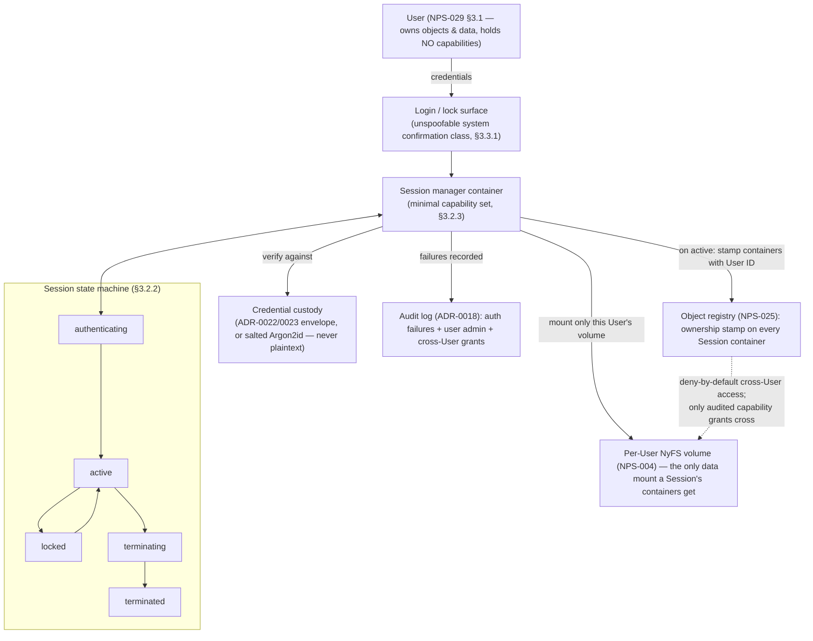

# Identity Subsystem

*Source: NPS-029 (§3 the identity model, §5 per-user data separation,
§6 administrative surfaces), NPS-025 §4.14/v1.1.0 (the User/Session
object types), NPS-015 §5.2 (the unspoofable-surface class the login
surface joins), ADR-0022/0023 (credential custody).*

**Rules the structure encodes:**

- A User holds **no** capabilities — a Session inherits authority into
  the containers it starts, leaving the kernel's sole-arbiter rule
  (NPS-003 §5.4) untouched (NPS-029 §3.1.3).
- The session machine's continuity rule: entering or leaving `locked`
  **MUST NOT** terminate running containers — a locked session
  preserves its applications behind the lock surface (§3.2.2), which
  makes the lock surface as trust-critical as login (the recorded
  FIND-IDENT-0001 candidate).
- Authentication composes with existing custody: verifiers live in
  vault envelope encryption or as salted memory-hard hashes — never
  plaintext (§3.3.2); failures are rate-limited and audit-chained
  without leaking which factor failed (§3.3.3).
- Per-user separation adds **no second mechanism**: ownership stamps
  (§5.1) make "whose" mechanically checkable, per-User volumes
  (§5.2) reuse NyFS mount isolation, and cross-User access is
  deny-by-default through ordinary audited capability grants only.
- No default or backdoor account exists; the first User is created at
  first boot before any desktop session (§6.2).
