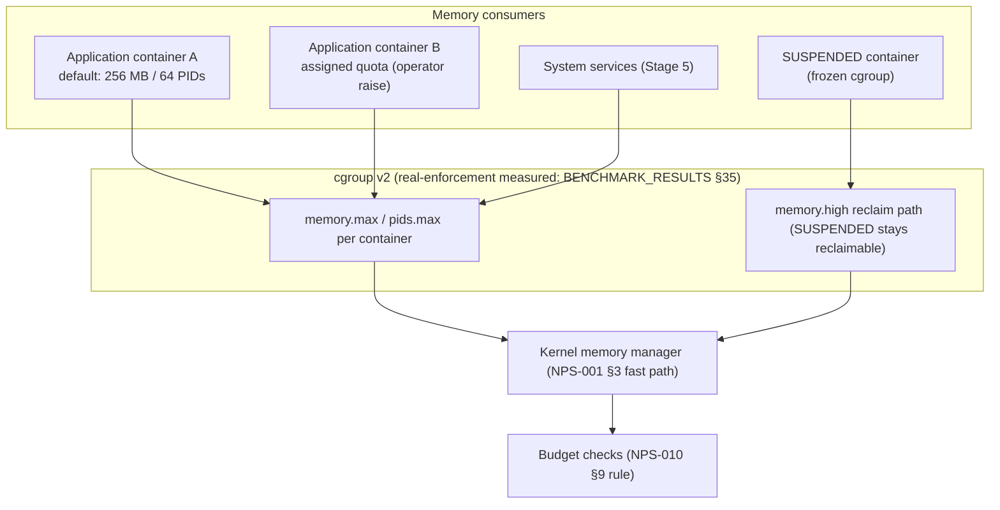

# Memory Manager

*Source: NPS-010 §7 (resource limits — §7.1 fair shares, §7.2
assignable limits), §9's adopted defaults (Architecture Group,
2026-09-19: 256 MB / 64 PIDs / unlimited quota + the SUSPENDED
accounting rule), NPS-001 §3 (the kernel's memory-manager fast
path), ADR-0013 (CPU-side weight table).*

**Rules the structure encodes:**

- The default container budget is **256 MB / 64 PIDs / unlimited
  quota** (adopted 2026-09-19 from the §35 data: representative shapes
  peak 3.2–9.0 MB — 28–80× headroom at the floor; nothing of the
  measured class is throttled by the default). Raising a limit is an
  explicit operator act (≥2.5× sizing + p95/`nr_throttled` monitoring
  for assigned quotas).
- **SUSPENDED accounting is normative**: a frozen container counts
  FULLY against memory budgets and NOT AT ALL against CPU budgets —
  budget checks MUST NOT treat suspension as memory relief. The
  frozen cgroup remains kernel-reclaimable via `memory.high`.
- Quota throttling is a **tail** phenomenon (p50 unchanged, p95 grows
  ~8× under the §35 measurement) — which is why the default stays
  unlimited and quotas are sized with the p95 rule, not the median.
- CPU-side scheduling lives in the scheduler diagram (ADR-0013's
  weight table + RT reserve); the memory side has no weight table —
  it is limits + reclaim, by design.
- The limit *values* were adopted as defaults, not laws of nature:
  §9 keeps the revisit trigger (measure the real app stack:
  NyRuntime + compositor + shell) written next to the number.
