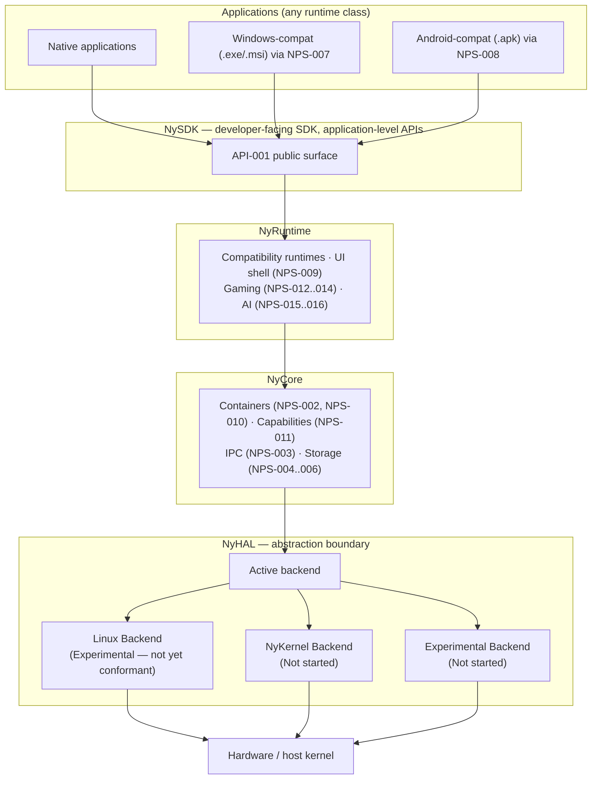

# NyHAL Architecture

*Source: NPS-017 §3. Each layer depends only on the layer directly beneath
it; nothing above NyCore may call into a backend's native mechanisms.*

**Key rule** (NPS-017 §3.2): NySDK/NyRuntime code **MUST NOT** call a
backend's native mechanisms directly — all access passes through NyCore's
contracts. An application built against NySDK runs unmodified on any
conformant backend (NPS-017 §7.1).
