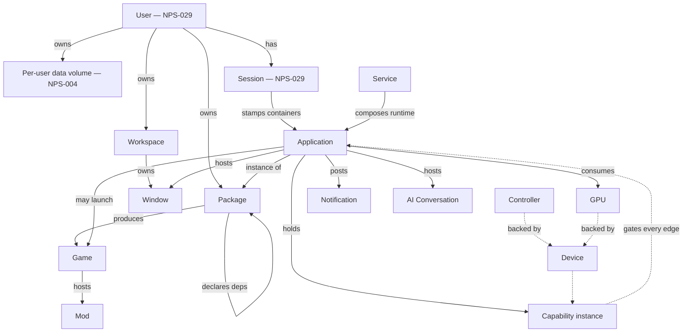

# Object Graph

*Source: NPS-025 §4 (the object type catalogue) — this diagram renders
the catalogue's Relationships rows; the types' normative definitions
live in NPS-025 (User/Session in NPS-029 §4).*

**Rules the graph encodes:**

- Every solid edge is ownership or composition (NPS-025 §4's
  Relationships rows); dashed edges are the capability-gated access
  paths (§3.2 — no edge exists outside the capability model).
- `User` owns objects but holds **no** capabilities directly — authority
  flows only through Sessions into containers (NPS-029 §3.1.3).
- Object IDs are stable and never reused across the whole graph
  (NPS-025 §3.1).
