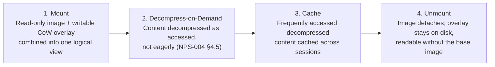

# Package (`.nygi`) Mount Lifecycle

*Source: NPS-006 §5, §4 (overlay), §7 (uninstall).*

**Overlay guarantees** (NPS-006 §4):

- Writes into the "install directory" (saves, config, mods) are
  transparently redirected into the overlay; the application never knows
  the directory is read-only image + overlay.
- The overlay persists independently of the base image — deleting or
  re-verifying the base image must not delete saves (NPS-006 §4.3).
- Overlay data is included in backups by default; the reproducible base
  image may be excluded, with the user informed and able to override
  (NPS-006 §4.4).

**Uninstall** (NPS-006 §7): base image removed; overlay retained by
default and offered for deletion as a separate explicit choice.

**Verification** (NPS-006 §6): integrity checks against manifest
checksums must not require full decompression; failures are reported
before launch, never silently mid-session.
