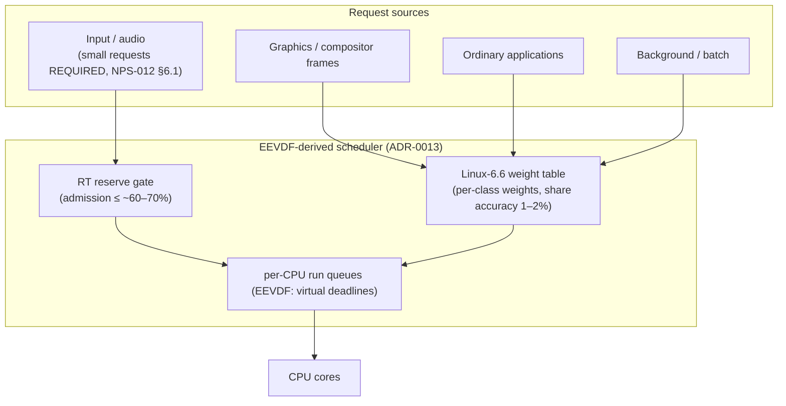

# Scheduler Structure

*Source: NPS-002 (Process and Thread Model — Draft), ADR-0013
(EEVDF-derived scheduler, Accepted 2026-09-19 — data §33: the
Linux-6.6 weight table, RT reserve ≤ ~60–70%, the small-request
requirement), NPS-012 §6.1 (input/audio request shape).*

**Rules the structure encodes:**

- Interactive latency is governed by *request size*: ≤ 1.5 ms requests
  produce zero overruns in the §33 simulation — small requests are a
  REQUIREMENT for the input/audio classes, not a suggestion.
- The real-time reserve is non-optional: RT admission is capped at
  ~60–70% so RT classes cannot starve the weighted classes.
- Class weights come from the Linux-6.6 table (the data's best tail
  isolation); shares are accurate to 1–2% under the §33 load.
- Status caveat: NPS-002 remains Draft — its real-time scheduling
  numbers require benchmark data; this diagram renders the Accepted
  ADR-0013 mechanism and the Draft spec's structure, and inherits
  whichever changes first.
