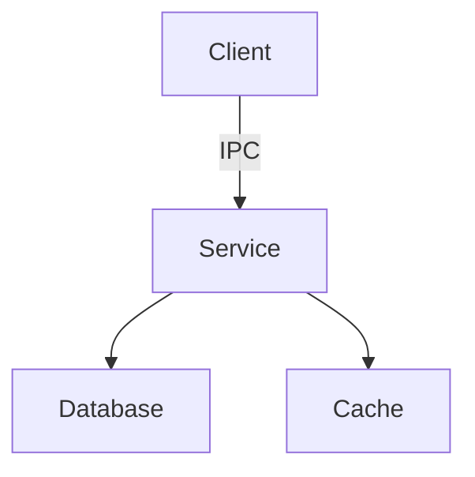

# TUT-003 — Developer Onboarding

Welcome to the Nyrqis project! This tutorial will get you from zero to
your first contribution.

## Prerequisites

### System Requirements

- **OS**: Linux (Ubuntu 22.04+ or equivalent)
- **RAM**: 8 GB minimum, 16 GB recommended
- **Disk**: 20 GB free space
- **CPU**: 4+ cores recommended for builds

### Software Requirements

```bash
# Essential tools
sudo apt install -y \
  build-essential \
  git \
  curl \
  python3.12 \
  python3.12-dev \
  python3-pip

# Rust toolchain
curl --proto '=https' --tlsv1.2 -sSf https://sh.rustup.rs | sh
source ~/.cargo/env

# Python packages
pip3 install --break-system-packages pillow watchdog pytest

# Optional: Docker for cross-compilation
sudo apt install -y docker.io docker-compose-v2
```

## First Build

### 1. Clone the Repository

```bash
git clone https://github.com/Myco-mycelium/Nythera.git
cd Nythera
```

### 2. Build Rust Crates

```bash
cd source/nyhal-linux-backend

# Build all Rust crates
cargo build --release

# Run Rust tests
cargo test
```

### 3. Build Python Package

```bash
# Install in development mode
pip3 install -e .

# Or build wheel
python3 -m build
```

### 4. Run Tests

```bash
# Full test suite
python3 -B test_backend.py

# Quick tests (no hardware)
./run_tests.sh --quick

# Wayland tests
python3 -m unittest discover -s tests -p "test_wayland*.py"
```

### 5. Verify Build

```bash
# Check all tests pass
python3 -B test_backend.py 2>&1 | tail -5
# Expected: "OK" with 2600+ tests passing
```

## Repository Tour

```
Nyrqis/
├── docs/                    # All documentation (Diátaxis)
│   ├── 00-platform/        # Foundational governance
│   ├── tutorials/          # Learning-oriented guides
│   ├── how-to/             # Task-oriented guides
│   ├── reference/          # Technical reference
│   └── explanation/        # Design rationale
├── source/                  # Implementation code
│   └── nyhal-linux-backend/ # Linux Backend
│       ├── rust/           # Rust crates (seccomp, ipc, wayland, gbm, drm, compositor)
│       ├── ui/             # Python UI layer (compositor, wayland, shell)
│       ├── backend/        # Container management
│       ├── ipc/            # IPC transport
│       ├── fuse/           # NyFS filesystem
│       ├── boot/           # Boot lifecycle
│       └── tests/          # Test suite
├── tools/                   # Build tooling, CLI utilities
├── tests/                   # Benchmarks, validation
├── sdk/                     # Developer SDK (future)
├── examples/                # Example applications
└── engineering/             # RFCs, working notes
```

## Coding Standards

### Rust

- **Style**: `rustfmt` default settings
- **Linting**: `clippy` with `-D warnings`
- **Documentation**: All public items must have `///` doc comments
- **Error handling**: Use `Result<T, E>` instead of panics
- **Unsafe**: Minimize; document safety invariants in comments

```rust
/// Calculate the IPC round-trip latency.
///
/// # Arguments
/// * `iterations` - Number of iterations to run
///
/// # Returns
/// Median latency in microseconds.
pub fn measure_ipc_latency(iterations: u32) -> f64 {
    // Implementation
}
```

### Python

- **Style**: PEP 8, enforced by `black`
- **Linting**: `pylint` with project-specific config
- **Type hints**: Required for all public functions
- **Docstrings**: Google style, required for all public functions

```python
def measure_ipc_latency(iterations: int = 10000) -> float:
    """Measure IPC round-trip latency.
    
    Args:
        iterations: Number of iterations to run.
        
    Returns:
        Median latency in microseconds.
    """
    # Implementation
```

### Documentation

- **Format**: Markdown with YAML frontmatter
- **Diátaxis**: Follow the framework (tutorials, how-to, reference, explanation)
- **Links**: Use relative links within documentation
- **Diagrams**: Use Mermaid for architecture diagrams

## First Contribution

### 1. Find an Issue

Look for issues labeled:
- `good-first-issue` - Perfect for newcomers
- `help-wanted` - Need community help
- `documentation` - Documentation improvements

### 2. Create a Branch

```bash
git checkout -b feature/123-fix-ipc-latency
```

### 3. Make Changes

Follow the coding standards above. Keep changes focused and small.

### 4. Write Tests

```python
def test_my_feature():
    """Test that my feature works correctly."""
    result = my_function()
    assert result == expected_value
```

### 5. Run Tests

```bash
# Run affected tests
pytest tests/test_my_module.py -v

# Run full suite (before submitting)
python3 -B test_backend.py
```

### 6. Submit PR

```bash
git add .
git commit -m "feat(ipc): add latency measurement

Implements the IPC latency benchmark requested in BENCHMARK_PLAN §1.

Closes #123"
git push origin feature/123-fix-ipc-latency
```

### 7. PR Review Checklist

- [ ] All CI checks passing
- [ ] Tests added for new functionality
- [ ] Documentation updated (if applicable)
- [ ] Commit messages follow conventions
- [ ] No sensitive data in code or commits

## Debugging

### Common Issues

**Build fails with "Rust toolchain not found"**
```bash
# Ensure Rust is in PATH
source ~/.cargo/env
rustc --version
```

**Tests fail with "ModuleNotFoundError"**
```bash
# Install in development mode
pip3 install -e .
```

**Wayland tests skipped**
```bash
# Expected if no Wayland compositor available
# Tests skip gracefully in headless environments
```

### Debug Tools

```bash
# Verbose test output
pytest -v -s tests/test_my_module.py

# Rust debug build with symbols
cargo build --debug

# Python debugger
python3 -m pdb -m pytest tests/test_my_module.py
```

### Logging

```python
import logging
logging.basicConfig(level=logging.DEBUG)
logger = logging.getLogger(__name__)
logger.debug("Variable value: %s", my_variable)
```

## Testing

### Test Types

| Type | Location | Command |
|------|----------|---------|
| Unit | `tests/test_*.py` | `pytest tests/test_*.py` |
| Integration | `tests/test_integration_*.py` | `pytest tests/test_integration_*.py` |
| Rust unit | `rust/*/src/*.rs` | `cargo test` |
| Conformance | `tests/test_conformance_*.py` | `pytest tests/test_conformance_*.py` |

### Writing Tests

```python
import unittest

class TestMyFeature(unittest.TestCase):
    def test_basic_functionality(self):
        """Test basic functionality works."""
        result = my_function(input_data)
        self.assertEqual(result, expected_output)
    
    def test_edge_case(self):
        """Test edge case handling."""
        result = my_function(edge_case_input)
        self.assertIsNone(result)
    
    def test_error_handling(self):
        """Test error handling."""
        with self.assertRaises(ValueError):
            my_function(invalid_input)
```

### Test Coverage

```bash
# Generate coverage report
pytest --cov=ui --cov-report=html

# View coverage
open htmlcov/index.html
```

## Documentation Style

### Writing Guidelines

1. **Be concise**: One idea per paragraph
2. **Use examples**: Show, don't just tell
3. **Link related content**: Cross-reference documents
4. **Keep updated**: Documentation rots; keep it fresh

### Diagramming

Use Mermaid for architecture diagrams:



### Code Blocks

Always specify language for syntax highlighting:

````markdown
```python
def example():
    pass
```
````

## Getting Help

- **Issues**: GitHub Issues for bugs and feature requests
- **Discussions**: GitHub Discussions for questions
- **Chat**: Real-time chat (if available)
- **Documentation**: This docs site

## Next Steps

1. Read the [Engineering Handbook](../00-platform/003-ENGINEERING_HANDBOOK.md)
2. Review [Architecture Decisions](../reference/adr/)
3. Explore the [Specification Index](../00-platform/004-SPECIFICATION_INDEX.md)
4. Check the [Project Roadmap](../00-platform/007-PROJECT_ROADMAP.md)

---

**Congratulations!** You're now ready to contribute to Nyrqis.
Welcome to the project! 🎉
